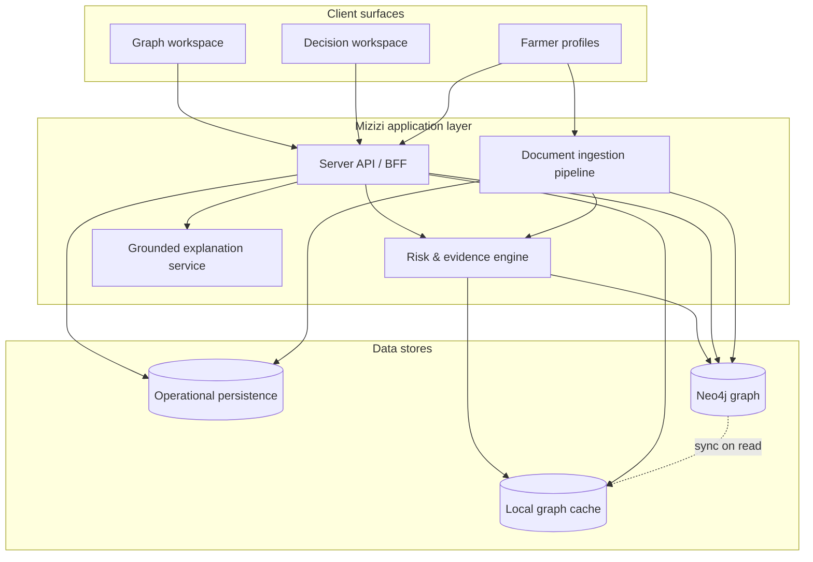

# Mizizi Neo4j Graph Intelligence — Implementation Document

**Version:** 1.0  
**Product:** Mizizi — Enterprise Agricultural Risk Intelligence (Kenya AI Challenge 2026)  
**Organization:** LESOM Dynamics  
**Last updated:** June 2026

---

## 1. Executive summary

Mizizi is an agricultural credit risk intelligence platform built for lenders, cooperatives, and field officers operating in Kenya. Neo4j is the **system of graph intelligence** behind Mizizi: it models relationships between farmers, cooperatives, loans, input suppliers, climate zones, and verified documents, and powers explainable credit decisions with traceable evidence paths.

Neo4j is **not** used as a visualization gimmick. Every risk factor that references the graph can be resolved to a concrete traversal in the database. Explanations shown to loan officers and farmers are grounded in those verified paths—not invented by the language model.

The platform supports two production-equivalent deployment modes:

| Mode | Target | Typical use |
| ---- | ------ | ----------- |
| **Local** | Neo4j 5 via Docker on a developer or on-prem machine | Development, demos, air-gapped pilots |
| **Aura** | Neo4j Aura (Free or Pro) in the cloud | Staging, production, challenge submissions |

When Neo4j is unavailable, Mizizi degrades gracefully to a local graph cache so officers can continue working; the UI clearly indicates when live graph data is offline.

---

## 2. Design principles

1. **Graph-first intelligence** — Agricultural finance is a relationship problem. Risk propagates through cooperatives, dealers, repayment communities, and climate exposure—not isolated rows in a table.

2. **Verified evidence only** — AI explains; humans decide. Large language models translate graph-derived facts into prose. They never fabricate relationships or scores.

3. **Idempotent sync** — All graph writes use merge semantics so re-seeding, document confirmation, and retries do not duplicate entities.

4. **Dual-write resilience** — Authoritative operational data (farmers, decisions, documents) lives in the application persistence layer; Neo4j holds the relationship view. Successful Neo4j reads are cached locally for performance and offline resilience.

5. **Profile portability** — The same application binary connects to local Bolt or Aura TLS (`neo4j+s://`) through environment configuration only—no code forks.

---

## 3. Architecture overview



### Request flow (graph read)

1. Officer opens the graph workspace or a decision with graph evidence.
2. The server attempts a **variable-length subgraph query** from the farmer root node (depth 1–3).
3. On success, nodes and relationships are normalized to business IDs (not internal Neo4j element IDs) for visualization.
4. The payload is returned to the client and optionally cached in the operational store.
5. On failure or missing credentials, the server serves the last known local graph payload and marks the source as offline in the UI.

### Request flow (graph write)

1. **Seed / farmer creation** — Core entities (farmer, cooperative, loan, dealer, climate zone) are merged with typed relationships.
2. **Document confirmation** — After an officer confirms an uploaded document, extracted entities (cooperative name, parcel size, document metadata) are merged into the graph with provenance links.
3. **Risk reassessment** — Graph metrics (degree, document count, optional trust scores) feed the risk engine; factors receive resolved evidence paths.

---

## 4. Graph data model

### 4.1 Node labels

| Label | Description | Key properties |
| ----- | ----------- | ---------------- |
| `Farmer` | Credit applicant / borrower | `id`, `name`, `county`, `risk`, `confidence` |
| `Cooperative` | Producer group | `id`, `name`, `county`, `trustScore` (optional, GDS) |
| `Loan` | Active or pending credit | `id`, `amountKes`, status fields |
| `InputDealer` | Input supplier counterparty | `id`, `name`, `county` |
| `ClimateZone` | County-aligned climate context | `id`, `name`, `droughtProbability` |
| `Document` | Officer-uploaded evidence | `id`, `name`, `type`, `verificationStatus`, `uploadedAt` |
| `FarmParcel` | Land parcel from extraction | `id`, `hectares` |
| `DataSource` | Provenance for evidence | `id`, `type`, `provider` |

### 4.2 Relationship types

| Pattern | Meaning |
| ------- | ------- |
| `(:Farmer)-[:MEMBER_OF]->(:Cooperative)` | Cooperative membership |
| `(:Farmer)-[:OWNS_LOAN]->(:Loan)` | Credit exposure |
| `(:Farmer)-[:PURCHASES_FROM]->(:InputDealer)` | Input supply chain link |
| `(:Farmer)-[:LOCATED_IN]->(:ClimateZone)` | Geographic / climate context |
| `(:Farmer)-[:HAS_DOCUMENT]->(:Document)` | Verified documentary evidence |
| `(:Farmer)-[:HAS_PARCEL]->(:FarmParcel)` | Land holding |
| `(:DataSource)-[:PROVIDED]->(:Document)` | Audit trail for uploads |
| `(:Cooperative)-[:WORKS_WITH]->(:InputDealer)` | Cooperative–dealer network |

### 4.3 Identity conventions

Stable business keys ensure idempotent merges and consistent evidence paths:

- **Farmer** — Application IDs such as `f-001`, `f-002`, …
- **Cooperative** — `coop-{farmerId}` at seed time; may merge to `coop-{slug}` when confirmed from documents
- **Loan** — `loan-{farmerId}`
- **Input dealer** — `dealer-{farmerId}`
- **Climate zone** — `zone-{county-slug}` (e.g. `zone-kiambu`)
- **Farm parcel** — `parcel-{farmerId}`

### 4.4 Schema constraints

Uniqueness constraints are applied on the `id` property for every node label before data load. This guarantees one node per business entity and safe `MERGE` operations during sync and ingestion.

---

## 5. Query patterns

### 5.1 Subgraph exploration

The graph workspace loads a farmer-centered neighborhood using variable-length path expansion (1–3 hops). Results include all distinct nodes and relationships on paths from the root, suitable for force-directed layout in the UI.

### 5.2 Evidence resolution (per risk factor)

Each decision factor carries a **source** tag. The evidence engine runs a targeted pattern match:

| Factor source | Graph pattern |
| ------------- | ------------- |
| Climate stress | `Farmer → LOCATED_IN → ClimateZone` |
| Repayment consistency | `Farmer → OWNS_LOAN → Loan` |
| Network strength | `Farmer → MEMBER_OF → Cooperative` |
| Profile completeness | `Farmer → HAS_DOCUMENT → Document` (most recent) |

Resolved paths are stored as structured **graph evidence steps**: node label, display name, relationship type, and business ID—displayed in the decision workspace with a “verified” indicator when sourced from Neo4j.

### 5.3 Graph metrics

For risk scoring, the platform computes:

- **Degree** — Count of relationships incident to the farmer node
- **Document count** — Number of linked `Document` nodes
- **Cooperative trust** — `trustScore` property when Graph Data Science (GDS) PageRank has been run (optional)

When GDS is unavailable (Aura Free, local without plugin), degree and document metrics still apply; trust scoring falls back to relationship density heuristics.

### 5.4 Optional GDS analytics

On Neo4j deployments with the GDS library (Aura Pro, self-managed Enterprise):

1. A projected graph is built over `Farmer` and `Cooperative` nodes with `MEMBER_OF` relationships.
2. PageRank runs and writes `trustScore` to cooperative nodes.
3. Elevated cooperative trust surfaces as a positive signal in risk assessment.

Aura Free does not include embedded GDS; all core features operate without it.

---

## 6. Explainability pipeline

Mizizi implements the product principle: **AI explains, humans decide.**

```text
Graph data (Neo4j)
        ↓
Graph metrics & evidence paths
        ↓
Risk factors (weighted, with graphEvidence)
        ↓
Grounded explanation (template or LLM)
        ↓
Officer decision (approve / decline / override)
```

**Grounding rules:**

- Explanations include only factors and paths present in the assessment payload.
- Verified graph paths are cited explicitly in officer-facing text.
- If evidence is insufficient (low completeness, no resolvable paths), the system returns: *“Additional data is required before a reliable explanation can be generated.”*
- The language model receives structured JSON of factors and evidence—it is instructed never to invent facts.

---

## 7. Data ingestion into the graph

### 7.1 Initial seed

On seed, each farmer profile in the operational database triggers a graph sync that merges the standard entity bundle (farmer, cooperative, loan, dealer, climate zone) and five relationship types. Seed output reports connectivity status and farmer node counts.

### 7.2 Document-driven enrichment

When a field officer uploads and **confirms** a classified document:

1. Extraction yields entities (cooperative name, parcel hectares, document type).
2. A `Document` node is merged and linked via `HAS_DOCUMENT`.
3. A `DataSource` node records upload provenance (`officer_upload`).
4. Optional `Cooperative` and `FarmParcel` nodes merge from extracted fields.
5. The farmer’s risk assessment re-runs with updated graph metrics and evidence.

Documents below a confidence threshold do not create entity nodes.

### 7.3 Agent-driven enrichment (Masumi)

External agent workflows can attach additional evidence through the same merge patterns, with `DataSource` typed as `masumi_agent` and optional transaction hash metadata for audit.

---

## 8. Deployment topologies

### 8.1 Local Neo4j (Docker)

**Components:** Neo4j 5 container, Bolt on port 7687, Browser on 7474, optional APOC plugin, health-checked startup.

**Configuration:**

| Variable | Example |
| -------- | ------- |
| `NEO4J_PROFILE` | `local` |
| `NEO4J_URI` | `bolt://localhost:7687` |
| `NEO4J_USER` | `neo4j` |
| `NEO4J_PASSWORD` | *(deployment-specific)* |
| `NEO4J_DATABASE` | `neo4j` |

**Bootstrap sequence:** merge env profile → start container → wait for health → apply constraints → seed application data → start web server.

**TLS note:** Local Docker uses unencrypted Bolt (`bolt://`). Do not use `neo4j+s://` against localhost unless TLS is explicitly configured.

### 8.2 Neo4j Aura (cloud)

**Components:** Managed Aura instance (Free or Pro), TLS Bolt (`neo4j+s://` or `neo4j+ssc://`).

**Configuration:**

| Variable | Example |
| -------- | ------- |
| `NEO4J_PROFILE` | `aura` |
| `NEO4J_URI` | `neo4j+s://xxxx.databases.neo4j.io` |
| `NEO4J_USER` | `neo4j` |
| `NEO4J_PASSWORD` | *(from Aura console, shown once)* |
| `NEO4J_DATABASE` | `neo4j` |
| `NEO4J_GDS` | `false` (Free) or `true` (Pro, optional) |

**Bootstrap sequence:** set credentials → apply constraints via setup command → seed → start web server. No Docker required.

### 8.3 Switching environments

Point environment variables at exactly one Neo4j target. After switching, re-run constraint setup and seed against the new database, then restart the application server so the driver reconnects.

---

## 9. Operations

### 9.1 Standard commands

| Command | Purpose |
| ------- | ------- |
| `neo4j:local` | Full local bootstrap (env, Docker, constraints, seed) |
| `neo4j:aura` | Aura bootstrap (constraints, seed) |
| `neo4j:setup` | Apply constraints; optional GDS trust refresh |
| `neo4j:verify` | JSON connectivity report with farmer and relationship counts |
| `neo4j:up` / `neo4j:down` | Start or stop local Docker |
| `seed` | Reset operational data and sync all farmers to Neo4j |

### 9.2 Health verification

**CLI:** `neo4j:verify` returns `connected`, `profile`, `uri`, `farmerNodes`, `relationshipCount`.

**Cypher sanity check:**

```cypher
MATCH (f:Farmer)-[r]->(n)
RETURN f.id, type(r), labels(n)[0], n.id
LIMIT 25
```

**UI:** The graph workspace displays a connection badge—green when Neo4j is live (local or aura), amber when operating on local fallback.

### 9.3 Expected scale (demo / challenge dataset)

| Metric | Typical seeded value |
| ------ | -------------------- |
| Farmers | 12 |
| Relationships per farmer | 4–6 core + documents |
| Subgraph depth | 1–3 hops (officer-selectable) |

Designed to remain well within Aura Free tier limits (512 MB). Production pilots should size Aura tier from projected farmer and document volume.

---

## 10. Security considerations

| Topic | Approach |
| ----- | -------- |
| **Credentials** | Stored in environment variables only; never committed to source control |
| **Transport** | TLS required for Aura (`neo4j+s://`); local dev may use plain Bolt |
| **Authentication** | Neo4j native username/password via official driver |
| **Authorization** | Application-layer role gating for officers; Neo4j user should have least privilege in production |
| **PII in graph** | Farmer names and counties stored as node properties—align retention with lender policy |
| **Audit** | `DataSource` nodes and document verification status support provenance queries |
| **Read-only ops** | Verification and reporting queries can use a read-only Neo4j user in production |

---

## 11. Resilience and fallback behavior

| Condition | Behavior |
| --------- | -------- |
| `NEO4J_URI` or password missing | Driver not initialized; all graph ops use local cache |
| Neo4j unreachable at read time | Serve cached graph; UI shows offline badge |
| Neo4j write fails during document sync | Local graph updated; sync marked failed on document record |
| GDS unavailable | Skip PageRank; use degree-based network metrics |
| Seed without Neo4j | Operational data seeds normally; graph syncs to local cache only |

The platform remains usable for demos and officer workflows without Neo4j; graph intelligence is degraded but not blocked.

---

## 12. User-facing surfaces

| Surface | Graph capability |
| ------- | ---------------- |
| **Graph workspace** | Force-directed map, depth control, connection status, entity search |
| **Decision workspace** | Graph path viewer with verified evidence per factor |
| **Contributing factors** | Inline evidence path strings |
| **Farmer profile — Documents** | Confirmed uploads sync to Neo4j |
| **Analytics — Graph tab** | Portfolio-level graph coverage metrics |

---

## 13. Compliance with Mizizi product standards

- Every recommendation traceable to stored factors and, where available, graph evidence paths.
- Explanations generated only from verified graph facts (PRD grounding standard).
- Officer override preserved with audit trail in operational persistence.
- Neo4j used as intelligence layer, not as a passive diagram export.

---

## 14. Roadmap (graph intelligence)

| Priority | Enhancement |
| -------- | ----------- |
| Near-term | Automated integration tests for evidence path resolution |
| Near-term | Production Neo4j RBAC and read-replica for analytics |
| Medium | Aura Graph Analytics sessions for large portfolio community detection |
| Medium | Vector indexes on document chunks for GraphRAG retrieval |
| Long-term | Real-time CDC from operational DB to Neo4j for multi-tenant lenders |

---

## 15. Related documentation

| Document | Audience |
| -------- | -------- |
| [Neo4j setup runbook](./neo4j.md) | Developers — install, env, troubleshooting |
| [Graph model reference](./graph-model.md) | Engineers — label and relationship quick reference |
| [Product specification](./product-spec.md) | Product — full PRD including explainability standards |

---

## 16. External references

- [Neo4j Aura](https://neo4j.com/cloud/platform/aura-graph/) — Managed cloud graph database
- [Neo4j Bolt protocol](https://neo4j.com/docs/bolt/current/) — Driver connectivity
- [Neo4j Graph Data Science](https://neo4j.com/docs/graph-data-science/current/) — Optional analytics library
- [Cypher query language](https://neo4j.com/docs/cypher-manual/current/) — Pattern matching and traversals

---

*© 2026 Mizizi / LESOM Dynamics. This document describes the Neo4j integration as implemented for the Kenya AI Challenge 2026 AgriFin Finance Challenge.*
